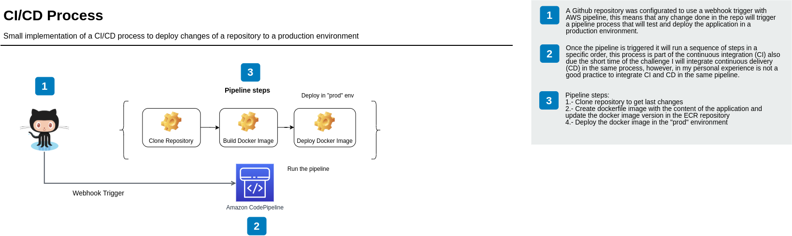
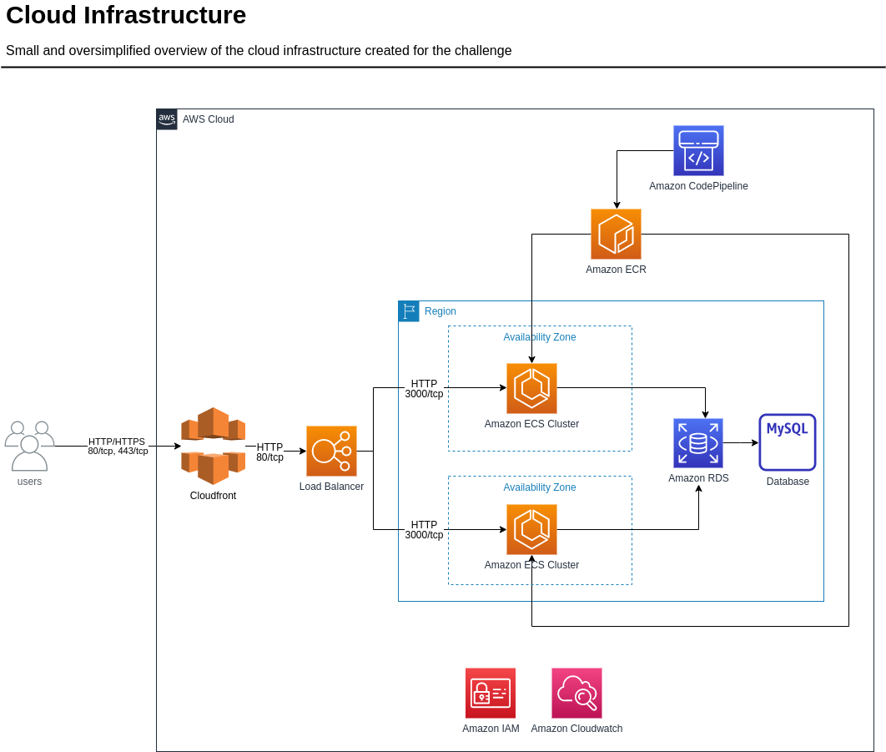
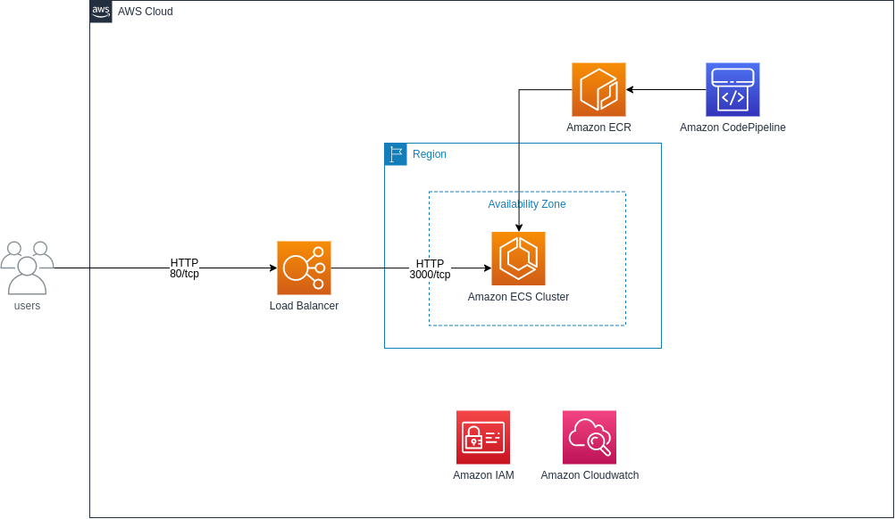

# timeoff-management-devops

Simple demo of an AWS cloud infrastructure solution and CI/CD process for the deployment of Timeoff Management Project.

## CI/CD Process Proposal
I decided to use AWS Codepipeline for all the CI/CD process as the pipeline can be defined as code using cloudformation, also can be integrated with many AWS services.
 
 


## Architecture Proposal
For the infrastructure I decided to use AWS, all the components and services can be defined as code using cloudformation. The approach of the solution was high available and ease integration of the CI/CD process.  

 


### Project Status
- [x] CI/CD pipeline (Completed)
- [ ] Cloud Infrastructure (Working on progress)

Cloud architecture working on progress:

 


### Deploy Stack
To deploy the stack in AWS you must create a bucket where all configurations will be uploaded and is required a GitHubToken for the integration of the pipeline and Github repository: 

```
git clone https://github.com/cgn170/timeoff-management-devops.git
cd timeoff-management-devops
chmod +x deploy.sh
# Create s3 repository for cloudformation templates
aws s3api create-bucket --region us-east-1 --bucket timeoff-management-devops-solution  
./deploy.sh timeoff-management-devops-solution
```
